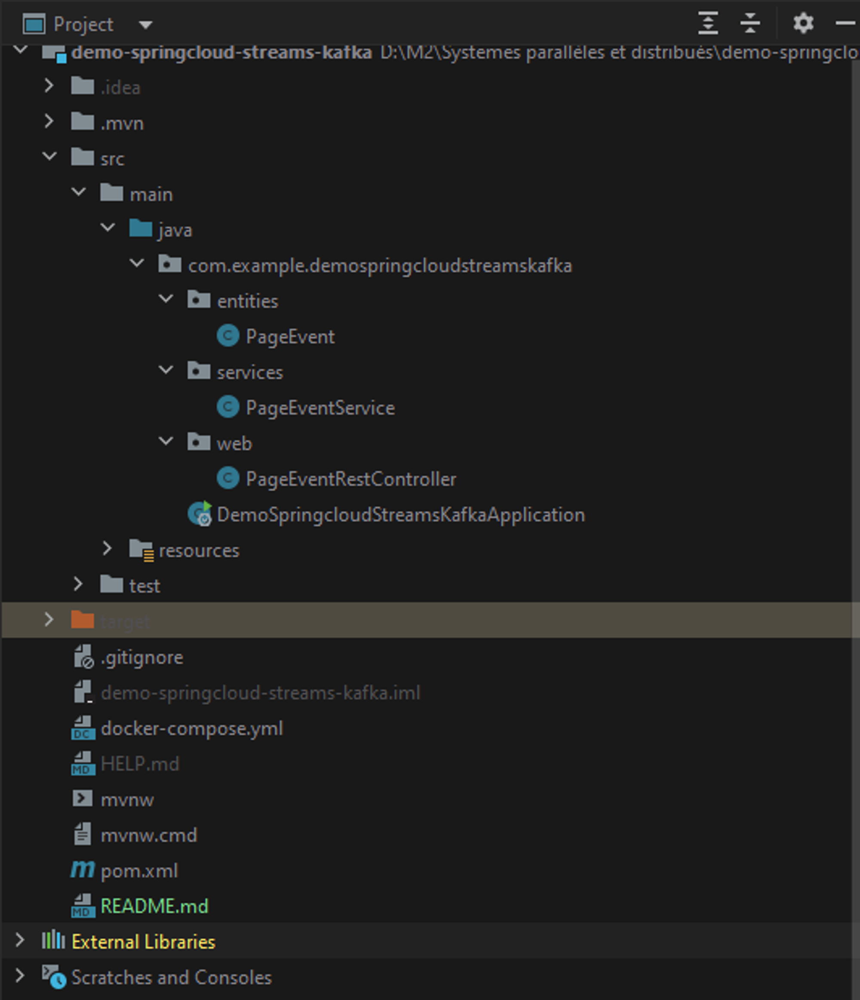
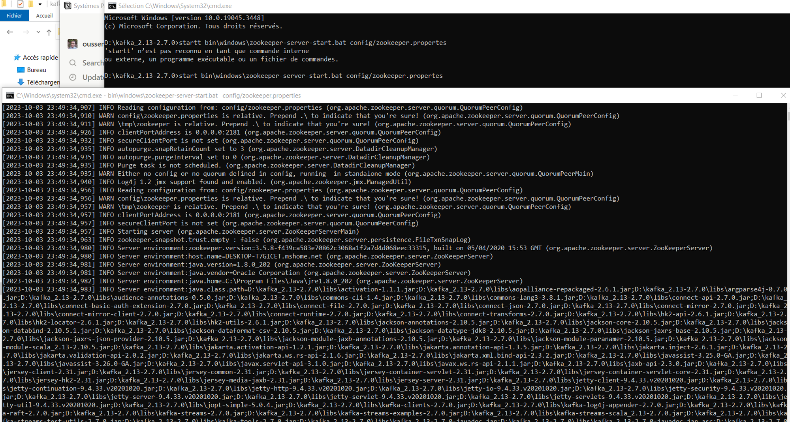
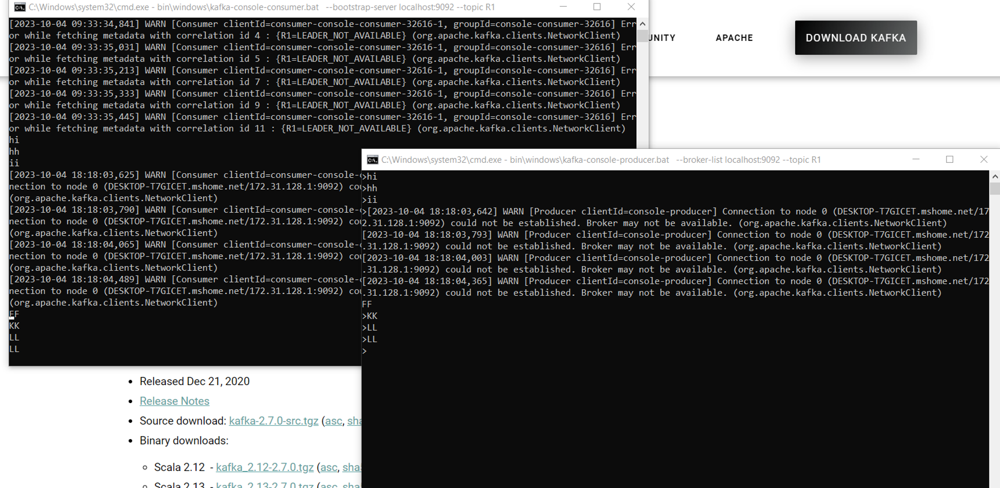
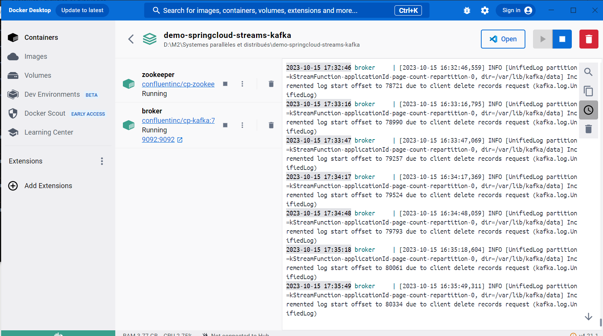
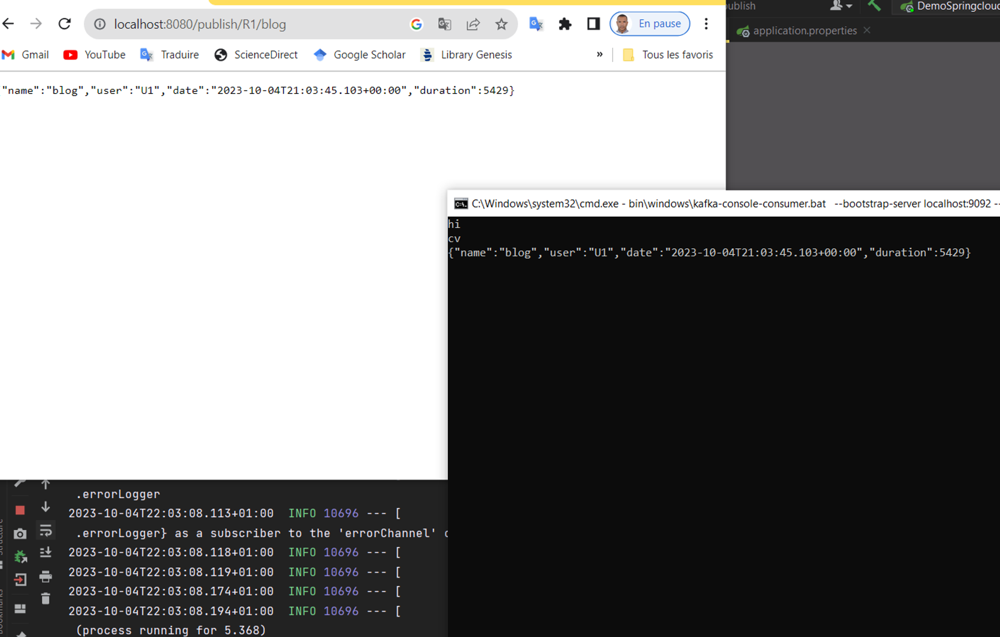
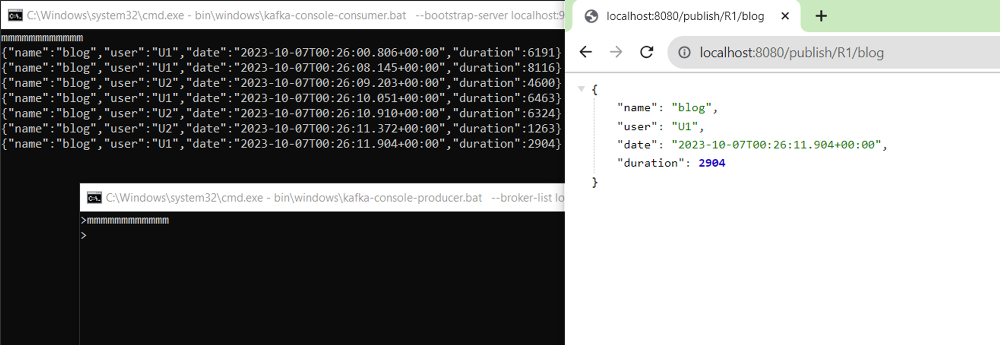
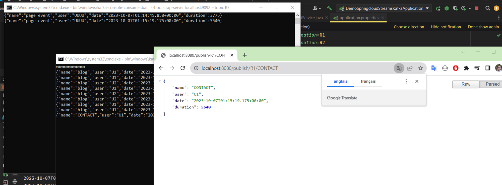
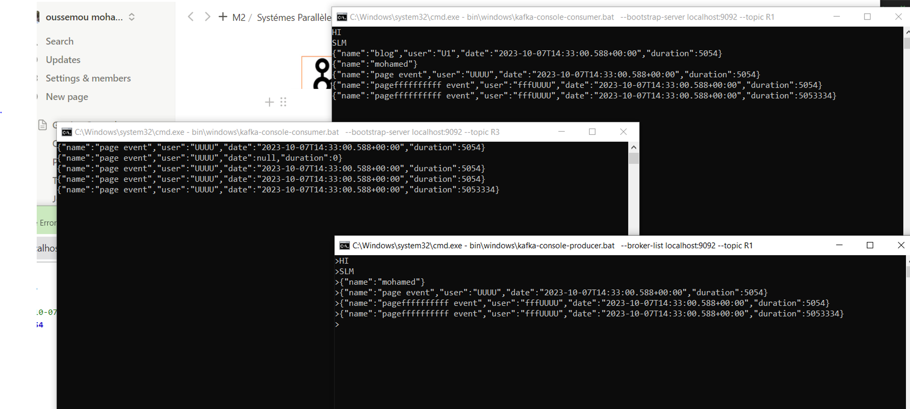

# Event Driven Distributed Processing
- KAFKA, KAFKA STREAMS
- Spring Cloud Stream Functions

```
This project harnesses Event-Driven Distributed Processing by employing Apache
 Kafka and Kafka Streams for real-time data ingestion, processing, and analysis.
 Additionally, it utilizes Spring Cloud Stream Functions to enhance these operations.
 
```

# Table of Contents
- [Prerequisites](#prerequisites)
- [Starting KAFKA Server](#starting-kafka-server)
    - [Start zookeeper](#start-zookeeper)
    - [Start KAFKA server](#start-kafka-server)

- [Services Types](#services-types)
    - [KAFKA Console](#kafka-console)
    - [Docker Compose](#docker-compose)
    - [Rest Controller with Stream Bridge](#rest-controller-with-stream-bridge)
    - [Cunsomer](#cunsomer)
    - [Supplier](#supplier)
    - [Function](#function)
    - [KAFKA Stream](#kafka-stream)


## Prerequisites
Before running this application, you need to have the following software installed on your system :

```java
- Java Development Kit (JDK) version 11 or later
- Kafka
```
## Project Structure

<pre>


</pre>

## Starting KAFKA Server

### Start zookeeper
`start bin\windows\zookeeper-server-start.bat config/zookeeper.properties`


### Start KAFKA server
`start bin\windows\kafka-server-start.bat config/server.properties`


## Services Types

### Kafka Console

> Subscribing to a topic to consume messages.

`start kafka-console-consumer.bat --bootstrap-server localhost:9092 --topic T1`

> Producing messages to the topic

`start kafka-console-producer.bat --broker-list localhost:9092 --topic T1`


### Docker compose
`docker-compose up -d`

`docker exec --interactive --tty broker kafka-console-consumer --bootstrap-server broker:9092 --topic T2`

`docker exec --interactive --tty broker kafka-console-producer --bootstrap-server broker:9092 --topic T2`


### Rest Controller with Stream Bridge

```java
    @GetMapping("/publish/{topic}/{name}")
    public PageEvent publish(@PathVariable String topic, @PathVariable String name){
        PageEvent pageEvent = new PageEvent(
                name,
                Math.random()>0.5?"U1":"U2",
                new Date(),
                (long) new Random().nextInt(9000));
        streamBridge.send(topic, pageEvent);
        return pageEvent;
    }
```




### Supplier

```java
    @Bean
    public Supplier<PageEvent> pageEventSupplier(){
        return ()-> new PageEvent(
                        Math.random()>0.5?"P1":"P2",
                        Math.random()>0.5?"U1":"U2",
                        new Date(),
                        (long) new Random().nextInt(9000)
                    );
    }
```

### Function

```java
    @Bean
    public Function<PageEvent, PageEvent> pageEventFunction(){
        return (input)->{
            input.setName(input.getName()+"after");
            input.setUser("User");
            return input;
        };
    }
```


### KAFKA Stream

*  Data Analytics Real Time Stream Processing with Kaflka Streams

```java
    @Bean
    public Function<KStream<String, PageEvent>, KStream<String, Long>> kStreamFunction(){
        return (input)->{
            return input
                    .filter((k,v) -> v.getDuration()>100)
                    .map((k,v) -> new KeyValue<>(v.getName(), 0L))
                    .groupBy((k,v) -> k, Grouped.with(Serdes.String(), Serdes.Long()))
                    .windowedBy(TimeWindows.of(Duration.ofMillis(5000)))
                    .count(Materialized.as("count-pages"))
                    .toStream()
                    .map((k,v) -> new KeyValue<>(""+ k.window().startTime() + " -> " + k.window().endTime() + " , page : " + k.key() , v));
        };
    }
```


* Web application that displays the results of Stream Data Analytics in real time

[m](Ma%20vidéo.gif)
